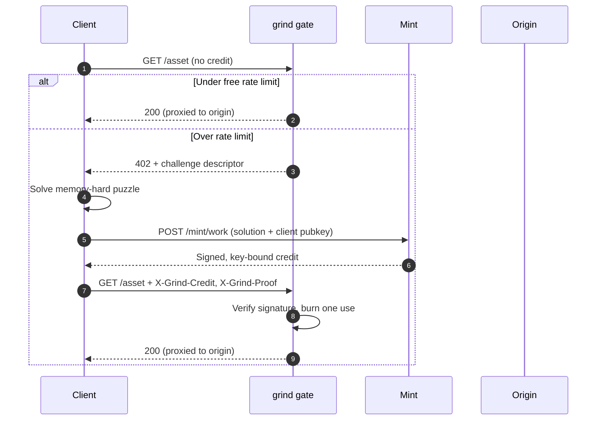

# grind

**A free-tier leg for HTTP 402.**

`x402` and L402 solved the paid leg of `402 Payment Required`. Nobody has
specified the other one. Today the only alternatives to paying are "be under
the rate limit" or "be blocked" — neither is expressible in the 402
handshake.

`grind` adds a third method: a client that will not or cannot pay can
instead **spend compute** and receive a credit the same gate accepts. One
verifier, two mints.

Name: Norwegian *grind* (a gate) and English *grind* (doing the work). Both
readings are the product.

Full design rationale, calibration, and open questions live in
[PLAN.md](./PLAN.md) — this file is the map, that one is the territory.

## Why

1. **A refusal becomes an offer.** Anonymous and unfunded clients get a path
   through the gate that needs no account, card, or wallet.
2. **One credit format for both legs.** The origin checks a signature, not a
   payment rail. Adding Lightning, USDC, or Cashu later touches only the mint.
3. **A price floor discovered by the market, not guessed.** Once work and
   money both mint credits, the exchange rate between them tells you what
   your free tier actually costs.

It is deliberately **not** a captcha — proof of work proves compute was
spent, not that a human spent it — and **not** a mining scheme: work-minted
credits are non-transferable by construction. See PLAN.md, "What this is
not."

## How it works



The mint is the trust boundary. The gate only checks a signature and a
per-key use counter, so it stays cheap enough for the hot path — puzzle
verification happens once per credit, not once per request.

### Two credit classes

The load-bearing design decision: work and money must **not** mint the same
transferable token, or someone farms credits on spot GPU and undercuts the
paid tier.

| | Work credit | Paid credit |
|---|---|---|
| Bound to | A client-generated pubkey | Nothing — bearer |
| Transferable | No | Yes |
| Double-spend defence | Per-key counter | Global spent-set |
| Resale value | Zero by construction | Equal to face value |

## Status

| Milestone | What it is | Status |
|---|---|---|
| M0 Library | Pure Go: puzzle (argon2id-over-hashcash) + credit signing/verification | **Done** — `puzzle/`, `credit/` |
| M1 Mint | `POST /mint/work`, work leg only | Not started |
| M2 Gate | Caddy `forward_auth`, token bucket, 402 emission | Not started |
| M3 Client | WASM solver, HTML interstitial, Go client library | **Done, separately** — [grind-client](https://git.pynezz.dev/pynezz/grind-client) |
| M4 Deploy | Instrument on `pynezz.dev` static assets | Not started |
| M5 Paid leg | Cashu mint, `x402` compatibility | Not started |

Live test results and benchmark trends: **[grind status dashboard](https://claude.ai/code/artifact/07d32503-9988-4dcf-9e88-588339d979da)**,
regenerated on every test run via `make dashboard`.

## Quick start

```go
import (
	"context"
	"time"

	"github.com/pynezz/grind/credit"
	"github.com/pynezz/grind/puzzle"
)

func main() {
	// Server side: issue a challenge.
	c, _ := puzzle.NewChallenge(puzzle.DefaultParams, 2*time.Minute)

	// Client side: solve it (a few seconds at the default difficulty).
	sol, _ := puzzle.Solve(context.Background(), c)

	// Server side: verify, then mint a credit bound to the client's key.
	if err := puzzle.Verify(c, sol, time.Now()); err != nil {
		panic(err)
	}
	signed, _ := credit.Mint(mintPrivKey, credit.WorkCredit{
		ClientPub: clientPubKey,
		Uses:      100,
		Exp:       time.Now().Add(time.Hour).Unix(),
	})
	_ = signed // encode with signed.Encode(), attach as X-Grind-Credit
}
```

## Project layout

```
puzzle/            argon2id-over-hashcash: challenge, solve, verify (M0)
credit/            work-credit signing and verification (M0)
internal/crockford/ shared token encoding, matches pynezz-hdauth/uptime
client/            Go client + WASM solver (M3) — see grind-client instead
cmd/mint/          mint binary (M1) — not yet implemented
cmd/gate/          gate binary (M2) — not yet implemented
tools/dashboard/   test+benchmark collector, renders the live status page
tools/admin/       demo protected-URL config console (Artifact, db-backed)
```

## Development

```sh
make build      # go build ./...
make test       # go test ./...
make vet        # go vet ./...
make bench      # the difficulty-scaling benchmark from PLAN.md's calibration table
make dashboard  # regenerate tools/dashboard/dist.html from a fresh run
```

## Related projects

`grind` is deliberately thin — it sits on parts that already exist. The full
table (`auth-gate`, `nutgate`, `litecoin-payment-service`,
`hardened-quadlets`, `pynezz-hdauth`, `hearth`) is in PLAN.md,
"Relationship to existing projects." The client side of the handshake lives
in its own repo for the same reason `grind` is thin: see
[grind-client](https://git.pynezz.dev/pynezz/grind-client) and its
`CLIENT.md`.
